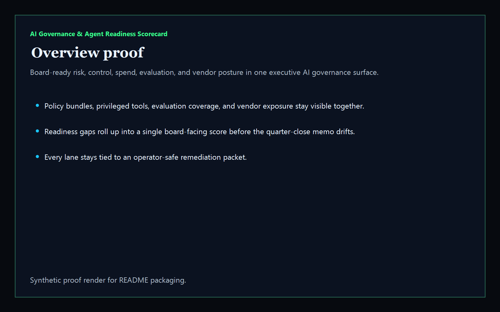
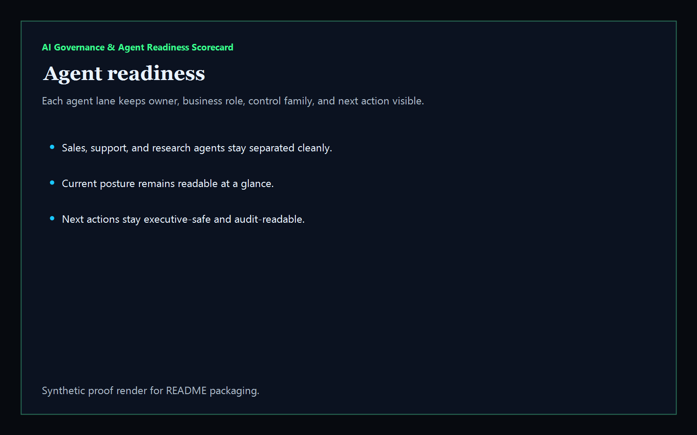
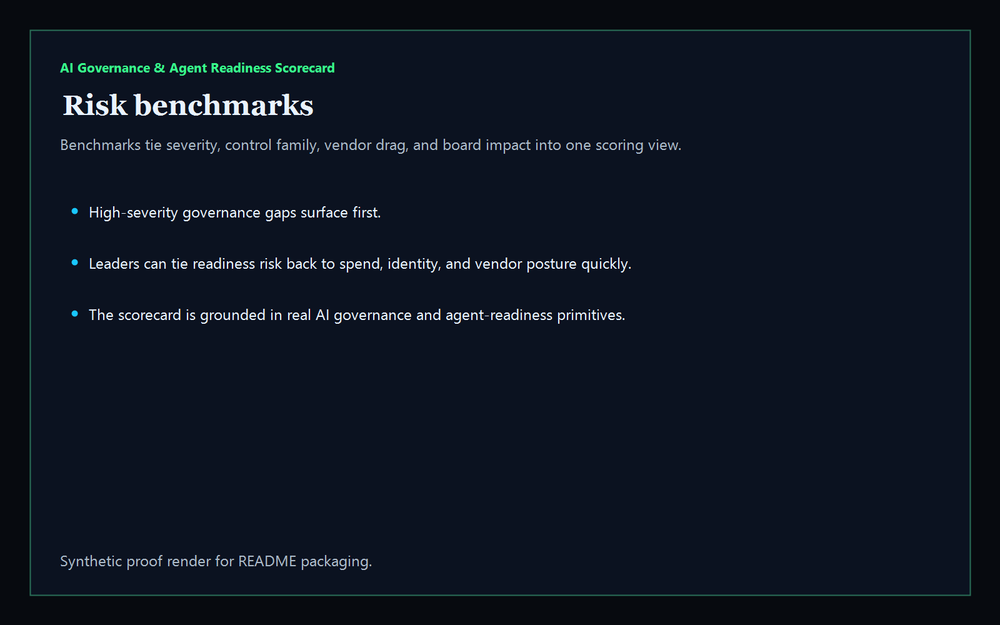
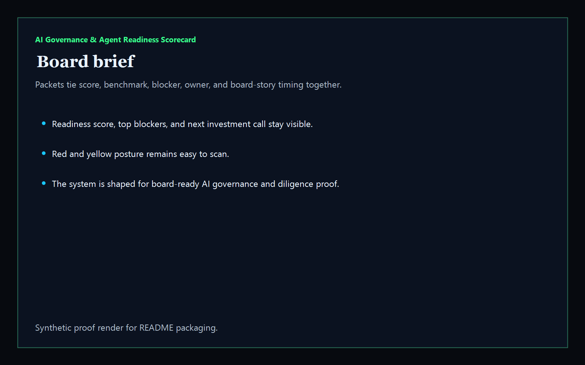

> ## ⚠️ Archived 2026-05-31 — superseded
>
> This repo is archived. The shape it set out to solve was already covered (and shipped) on the apex tool surface:
>
> **→ [https://kineticgain.com/trust/ai-system-card/](https://kineticgain.com/trust/ai-system-card/)** — AI System Card Builder + /policies/ 10-vertical readiness aggregator
>
> The apex surface is browser-only, no login, no telemetry, vanilla JS, aligned in vocabulary with NIST AI RMF / EU AI Act / ISO 42001 / SOC 2 / ISO 27018 / GDPR (never "compliant"/"certified" without external attestation).
>
> No migration needed — this repo never had production users; it was Codex-shipped scaffolding that landed in parallel with (and unaware of) the apex executive-tools layer.

---

# AI Governance & Agent Readiness Scorecard

[](https://github.com/mizcausevic-dev/ai-governance-agent-readiness-scorecard/actions/workflows/ci.yml)
[](https://github.com/mizcausevic-dev/ai-governance-agent-readiness-scorecard/actions/workflows/pages.yml)

Board-ready executive intelligence product for AI governance and agent readiness. It turns synthetic readiness packets into one scorecard covering policy-bundle posture, privileged tool scope, evaluation coverage, vendor spend controls, board-pack freshness, and investment posture.

## What it does

- executive scorecard for AI governance, exposure, savings, and investment priority
- agent-readiness lanes for policy bundles, tool scopes, evaluation coverage, and board-brief posture
- risk benchmark view for board-facing findings and owners
- board-brief packet view for diligence-ready executive summaries
- public synthetic control surface plus JSON APIs and CLI

## Routes

- `/`
- `/agent-readiness`
- `/risk-benchmarks`
- `/board-brief`
- `/verification`
- `/docs`

## API

- `/api/dashboard/summary`
- `/api/agent-readiness`
- `/api/risk-benchmarks`
- `/api/board-brief`
- `/api/verification`
- `/api/sample`

## Why this matters (KG Embedded tie-back)

This repo is the board-intelligence shape of Kinetic Gain Embedded. The same primitive can power executive scorecards, operating-partner diligence, portfolio benchmarking, and internal steering briefs without exposing live tenant credentials or write paths.

## Screenshots






## CLI

```powershell
npx ai-governance-agent-readiness-scorecard .\fixtures\ai-governance-readiness.json --format markdown
```

## Local run

```powershell
cd ai-governance-agent-readiness-scorecard
npm install
npm run verify
npm run prerender
npm run render:assets
npm run start
```

Then open:

- [http://127.0.0.1:5522/](http://127.0.0.1:5522/)
- [http://127.0.0.1:5522/agent-readiness](http://127.0.0.1:5522/agent-readiness)
- [http://127.0.0.1:5522/risk-benchmarks](http://127.0.0.1:5522/risk-benchmarks)
- [http://127.0.0.1:5522/board-brief](http://127.0.0.1:5522/board-brief)

## Live

- [https://readiness.kineticgain.com/](https://readiness.kineticgain.com/)

This repo publishes synthetic sample AI-governance data only. It does not ship live tenant credentials, vendor secrets, or authenticated write paths.